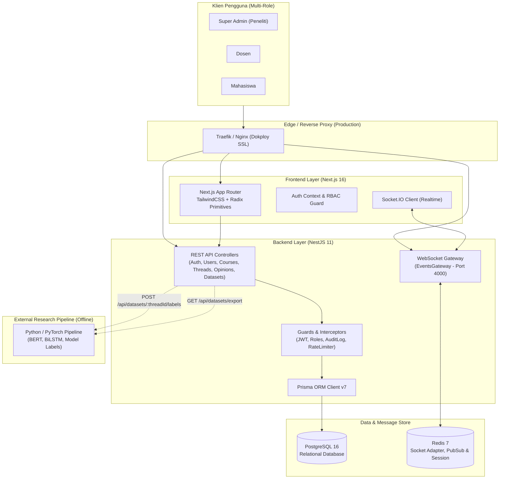
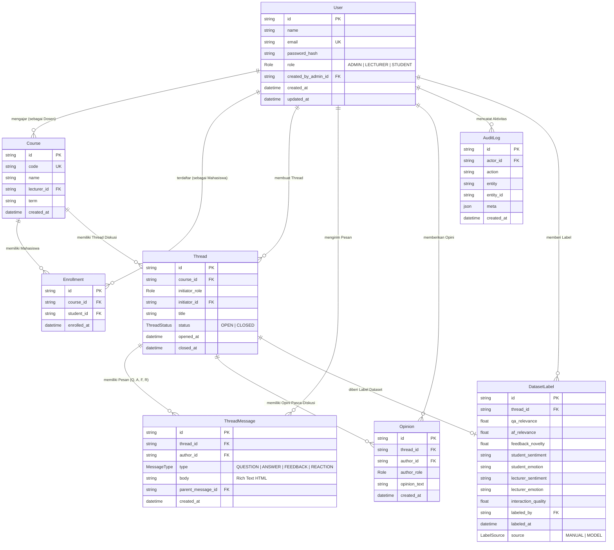

# ARJUNA LMS — Data Collection & Discussion Platform

<p align="center">
  
  
  
  
  
  
</p>

---

##  Ringkasan Eksekutif & Konteks Riset

**ARJUNA LMS** adalah platform Learning Management System (LMS) berbasis forum diskusi kelas terstruktur yang dirancang khusus untuk menghasilkan **data interaksi dosen–mahasiswa mentah** (*raw conversational datasets*) secara terstandarisasi untuk penelitian NLP **ARJUNA-Net** (ekstraksi fitur semantik, sentimen, emosi, dan fusi relevansi).

###  Tujuan Utama
1. **Pengumpulan Data Terstruktur**: Menangkap siklus interaksi akademik lengkap:
   $$\text{Pertanyaan Dosen} \longrightarrow \text{Jawaban Mahasiswa (Wajib)} \longrightarrow \text{Umpan Balik Dosen} \longrightarrow \text{Reaksi Mahasiswa} \longrightarrow \text{Opini Pasca-Interaksi}$$
2. **Kepatuhan Respons Mahasiswa**: Memastikan seluruh mahasiswa dalam kelas berpartisipasi aktif dalam setiap thread diskusi dengan sistem pelacakan kepatuhan real-time.
3. **Ekspor Dataset 1:1**: Menyediakan fitur ekspor dataset CSV 15 kolom terintegrasi yang siap diproses langsung oleh pipeline kecerdasan buatan (BiLSTM, BERT, SSWE/EWE+CNN, dan Decision Fusion).

---

##  Arsitektur Sistem Global

ARJUNA LMS dibangun dengan arsitektur monorepo modular yang memisahkan Backend API & WebSocket Gateway dengan Frontend Client Web.



---

##  Struktur Monorepo

```
arjuna-lms/
├── backend/                     # Backend API & WebSocket Gateway (NestJS)
│   ├── prisma/                  # Skema Database & Migrasi Prisma
│   │   ├── schema.prisma        # Definisi Model Data
│   │   └── seed.example.ts      # Template Seeding Data Awal
│   ├── src/
│   │   ├── auth/                # Autentikasi JWT (Access + Refresh Token via Cookie)
│   │   ├── common/              # Decorators, Guards, Interceptors (Audit), Prisma Service
│   │   ├── courses/             # Manajemen Kelas & Enrollment Mahasiswa
│   │   ├── datasets/            # Ekspor Dataset CSV 15 Kolom & Labeling API
│   │   ├── events/              # Real-time WebSocket Gateway & Redis Adapter
│   │   ├── opinions/            # Pengumpulan Opini Pasca-Diskusi
│   │   ├── threads/             # Forum Interaksi (Q -> A -> Feedback -> Reaction)
│   │   ├── users/               # Manajemen Pengguna & Bulk Import CSV
│   │   ├── app.module.ts        # Root Module NestJS
│   │   └── main.ts              # Entry point aplikasi backend
│   ├── Dockerfile               # Multi-stage Docker build backend
│   └── package.json
│
├── frontend/                    # Frontend Web Client (Next.js 16 App Router)
│   ├── src/
│   │   ├── app/
│   │   │   ├── dashboard/       # Dashboard Utama
│   │   │   │   ├── admin/       # Panel Peneliti: Users, Courses, Dataset Export
│   │   │   │   └── courses/     # Tampilan Kelas & Thread Diskusi
│   │   │   ├── login/           # Halaman Login
│   │   │   ├── globals.css      # Custom Design Tokens & TailwindCSS
│   │   │   └── layout.tsx       # Root Layout
│   │   └── lib/
│   │       ├── api.ts           # Axios / Fetch API Client Terstruktur
│   │       ├── auth-context.tsx # Autentikasi Global State
│   │       └── socket.ts        # Socket.IO Real-time Connection Manager
│   ├── Dockerfile               # Multi-stage Docker build frontend
│   └── package.json
│
├── docker-compose.yml           # Docker Compose untuk Pengembangan Lokal
├── docker-compose.prod.yml      # Docker Compose untuk Produksi (Dokploy / VPS)
├── DOKPLOY_DEPLOYMENT_GUIDE.md  # Panduan Lengkap Deployment Produksi
├── ISSUES_TRACKER.md            # Log Audit & Pengujian Kualitas
├── prd.md                       # Product Requirement Document Utama
└── README.md                    # Dokumentasi Proyek Terpusat
```

---

##  Model Basis Data (Entity Relationship)



---

##  Alur Siklus Interaksi (*Interaction Lifecycle*)

Setiap thread interaksi pada forum kelas memiliki alur sekuensial yang ketat:

```
[1. Dosen / Mahasiswa Post Pertanyaan]
  │   └── ThreadMessage (type: QUESTION)
  ▼
[2. Mahasiswa Menjawab Pertanyaan]
  │   └── ThreadMessage (type: ANSWER) ➔ WAJIB bagi seluruh mahasiswa di kelas
  ▼
[3. Dosen Memberikan Feedback Jawaban]
  │   └── ThreadMessage (type: FEEDBACK, parent_message_id: Answer.id)
  ▼
[4. Mahasiswa Memberikan Reaksi atas Feedback]
  │   └── ThreadMessage (type: REACTION, parent_message_id: Feedback.id)
  ▼
[5. Opini Pasca-Interaksi]
      ├── Mahasiswa: Memberikan penilaian & opini proses diskusi (Opinion)
      └── Dosen: Memberikan penilaian & opini hasil pembelajaran (Opinion)
```

---

##  Spesifikasi Ekspor Dataset (ARJUNA-Net 15 Kolom)

Dataset diekspor dalam format CSV/JSON melalui endpoint `GET /api/datasets/export` dengan pemetaan kolom 1:1:

| No | Nama Kolom | Tipe Data | Sumber Data LMS | Keterangan |
|---|---|---|---|---|
| 1 | `Course_ID` | String | `Course.id` | Identitas unik kelas |
| 2 | `Lecturer_ID` | String | `Course.lecturer_id` | ID dosen pengampu kelas |
| 3 | `Student_ID` | String | `Enrollment.student_id` | ID mahasiswa responden |
| 4 | `Lecturer_Question` | Text | `ThreadMessage (QUESTION)` | Teks pertanyaan dari dosen |
| 5 | `Student_Answer` | Text | `ThreadMessage (ANSWER)` | Teks jawaban mahasiswa |
| 6 | `Lecturer_Feedback` | Text | `ThreadMessage (FEEDBACK)` | Teks umpan balik dosen |
| 7 | `Student_Reaction` | Text | `ThreadMessage (REACTION)` | Teks reaksi mahasiswa |
| 8 | `Student_Opinion` | Text | `Opinion (author: STUDENT)` | Opini kualitatif mahasiswa |
| 9 | `Q-A_Relevance` | Float (0.0 - 1.0) | `DatasetLabel.qa_relevance` | Relevansi Pertanyaan vs Jawaban |
| 10 | `A-F_Relevance` | Float (0.0 - 1.0) | `DatasetLabel.af_relevance` | Relevansi Jawaban vs Feedback |
| 11 | `Feedback_Novelty` | Float (0.0 - 1.0) | `DatasetLabel.feedback_novelty` | Kebaruan materi pada feedback |
| 12 | `Student_Sentiment` | String | `DatasetLabel.student_sentiment` | Sentimen mahasiswa (Positif/Netral/Negatif) |
| 13 | `Student_Emotion` | String | `DatasetLabel.student_emotion` | Klasifikasi emosi mahasiswa |
| 14 | `Lecturer_Emotion` | String | `DatasetLabel.lecturer_emotion` | Klasifikasi emosi dosen |
| 15 | `Interaction_Quality`| Float (0.0 - 1.0) | `DatasetLabel.interaction_quality` | Skor agregat kualitas diskusi |

---

##  Dokumentasi REST API & WebSocket

### 1. Autentikasi (`/api/auth`)
- `POST /api/auth/login`: Login email & password (mengirimkan `access_token` & `refresh_token` via httpOnly cookie).
- `POST /api/auth/refresh`: Memperbarui access token menggunakan refresh token.
- `POST /api/auth/logout`: Membersihkan cookie sesi login.
- `GET /api/auth/me`: Mengambil data profil dan role pengguna yang sedang aktif.

### 2. Pengguna (`/api/users`)
- `GET /api/users`: Mengambil daftar pengguna (Admin only, mendukung filter role & search).
- `POST /api/users`: Membuat pengguna baru tunggal.
- `POST /api/users/bulk-import`: Mengimpor pengguna massal melalui file CSV (`name,email,role,password`).
- `PATCH /api/users/:id/password`: Reset password pengguna oleh Admin.

### 3. Kelas & Enrollment (`/api/courses`)
- `GET /api/courses`: Mengambil daftar kelas sesuai hak akses (Admin melihat semua, Dosen/Mahasiswa melihat kelas terkait).
- `GET /api/courses/:id`: Detail kelas beserta daftar mahasiswa terdaftar dan thread aktif.
- `POST /api/courses`: Membuat kelas baru dan menentukan dosen pengampu.
- `POST /api/courses/:id/enroll`: Menambahkan mahasiswa ke dalam kelas.

### 4. Forum Diskusi & Thread (`/api/threads`)
- `GET /api/threads?course_id=...`: Mengambil daftar thread dalam kelas.
- `GET /api/threads/:id`: Mengambil seluruh alur pesan dalam thread (Q, A, F, R) beserta status kepatuhan mahasiswa.
- `POST /api/threads`: Membuat thread diskusi baru (Pertanyaan Dosen / Pertanyaan Mahasiswa).
- `POST /api/threads/:id/messages`: Mengirim pesan balasan (Answer, Feedback, atau Reaction).

### 5. Opini Pasca-Interaksi (`/api/opinions`)
- `POST /api/opinions`: Menyimpan refleksi dan opini kualitatif dari mahasiswa atau dosen untuk thread tertentu.
- `GET /api/opinions?thread_id=...`: Mengambil daftar opini pada thread tersebut.

### 6. Dataset & Labeling (`/api/datasets`)
- `GET /api/datasets/export`: Mengunduh dataset dalam format CSV/JSON 15 kolom dengan filter kelas & tanggal.
- `GET /api/datasets/compliance`: Memantau metrik kepatuhan mahasiswa dalam menjawab pertanyaan per kelas.
- `POST /api/datasets/:threadId/labels`: Menyimpan label hasil model NLP atau anotasi manual.

### 7. Real-Time Events (WebSocket Gateway)
- **Namespace**: `/` (Socket.IO pada port 4000)
- **Room Subscriptions**:
  - `join_course`: Bergabung ke kanal pembaruan kelas (`course_{courseId}`).
  - `join_thread`: Bergabung ke kanal diskusi aktif (`thread_{threadId}`).
- **Server-to-Client Events**:
  - `new_message`: Menerima pesan baru secara langsung tanpa refresh.
  - `new_thread`: Notifikasi thread diskusi baru di kelas.
  - `student_answered`: Notifikasi saat mahasiswa menyelesaikan jawaban wajib.
  - `compliance_updated`: Pembaruan live status kelengkapan kelas.

---

##  Keamanan & Kualitas (*Hardening*)

1. **Password Hashing**: Menggunakan algoritma modern `argon2id` dengan parameter *memoryCost*, *timeCost*, dan *parallelism* standar OWASP.
2. **Token Security**: JWT Access Token (15 menit) dan Refresh Token (7 hari) disimpan eksklusif pada **httpOnly & SameSite Cookie**, mencegah eksfiltrasi token via serangan XSS.
3. **Role-Based Access Control (RBAC)**: Setiap endpoint dijaga oleh `@Roles()` decorator dan `RolesGuard` NestJS. Mahasiswa divalidasi ketat agar hanya dapat mengakses kelas yang mereka ikuti (*enrollment check*).
4. **Rate Limiting**: Dikonfigurasi menggunakan `@nestjs/throttler` (maksimal 60 request/menit untuk API publik dan 10 request/menit untuk auth).
5. **Integritas Audit Trail**: Seluruh tindakan penulisan dan modifikasi data krusial dicatat dalam tabel `audit_logs` melalui `AuditInterceptor`.
6. **Keamanan HTTP**: Perlindungan header keamanan HTTP menggunakan `helmet` dan konfigurasi CORS domain-whitelisting ketat.

---

##  Panduan Menjalankan di Lingkungan Lokal

### Prasyarat
- [Node.js](https://nodejs.org/) v20+ atau v22+
- [Docker & Docker Compose](https://www.docker.com/)
- [Git](https://git-scm.com/)

### Langkah 1: Clone Repository
```bash
git clone https://github.com/arifsuz/Arjuna-LMS.git
cd Arjuna-LMS
```

### Langkah 2: Jalankan Layanan Basis Data (PostgreSQL & Redis)
```bash
docker compose up -d postgres redis
```

### Langkah 3: Konfigurasi & Jalankan Backend
```bash
cd backend
cp .env.example .env
npm install
npx prisma db push
npm run start:dev
```
Backend akan aktif di `http://localhost:4000`.

### Langkah 4: Konfigurasi & Jalankan Frontend
```bash
cd ../frontend
cp .env.example .env.local  # Pastikan NEXT_PUBLIC_API_URL=http://localhost:4000/api
npm install
npm run dev
```
Frontend akan aktif di `http://localhost:3000`.

---

##  Panduan Deployment Produksi (Dokploy / VPS)

Untuk deployment lengkap dengan Docker Compose, konfigurasi Reverse Proxy Traefik, sertifikat SSL Let's Encrypt gratis otomatis, serta strategi backup database harian, silakan merujuk ke panduan resmi:
 **[DOKPLOY_DEPLOYMENT_GUIDE.md](file:///d:/arjuna-lms/DOKPLOY_DEPLOYMENT_GUIDE.md)**

---

##  Lisensi & Hak Cipta

Platform ini dikembangkan untuk kebutuhan riset akademik **ARJUNA-Net**. Seluruh hak cipta dilindungi undang-undang.
