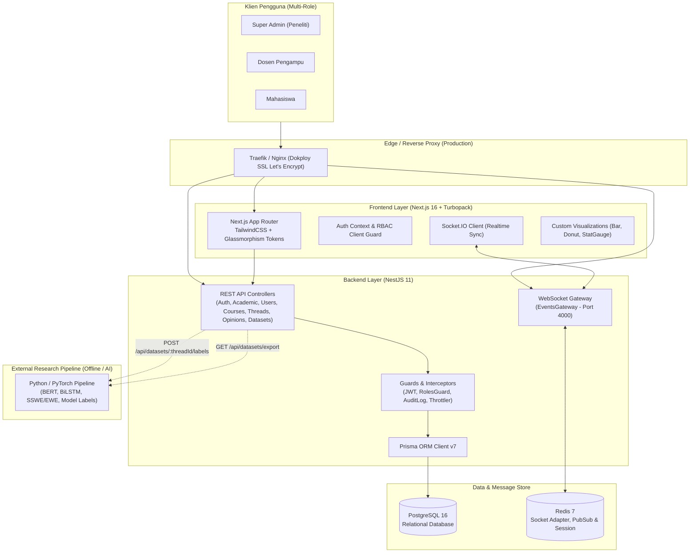

# ARJUNA LMS — Integrated Learning Management System & Research Data Engine

<p align="center">
  
  
  
  
  
  
  
</p>

---

## 1. Ringkasan Eksekutif & Konteks Riset

**ARJUNA LMS** adalah platform Learning Management System (LMS) modern berstandar enterprise yang mengintegrasikan seluruh proses perkuliahan akademik dengan mesin pengumpulan data percakapan kelas terstruktur (*raw conversational datasets*) untuk kebutuhan riset kecerdasan buatan **ARJUNA-Net** (ekstraksi fitur semantik, klasifikasi sentimen biner SSWE Dosen & Mahasiswa, pengenalan emosi EWE 5-Classes, dan fusi relevansi kualitas interaksi).

### Tujuan Utama Platform:
1. **Ekosistem LMS Akademik Komprehensif**: Mengakomodasi kurikulum RPS/CPL, modul multimedia (PDF, Video, SCORM/H5P), perkuliahan virtual (Google Meet & Zoom), tugas kuliah terintegrasi Turnitin Similarity Index, mesin kuis interaktif dengan *Dynamic Question Builder*, buku nilai (*Gradebook Matrix* A–E), serta *Early Warning System* mahasiswa berisiko.
2. **Siklus Interaksi Multi-Turn Terstruktur (*ARJUNA Flow*)**:
   $$\text{Pertanyaan Dosen (Q)} \longrightarrow \text{Jawaban Mahasiswa (A, Wajib)} \longrightarrow \text{Umpan Balik Dosen (F)} \longrightarrow \text{Reaksi Mahasiswa (R)} \longrightarrow \text{Refleksi \& Emosi Opini}$$
3. **Ekspor Dataset Terstandarisasi 18 Kolom / Label**: Menyediakan pipeline ekspor data interaksi 1:1 format CSV/JSON yang siap digunakan langsung oleh model AI/NLP (BiLSTM, BERT, CNN, dan Decision Fusion).
4. **Desain Berbasis Human-Computer Interaction (HCI)**: Memadukan estetika *Glassmorphism*, palet warna akademik eksklusif (*Deep Academic Blue* `#0A3266` & *Metallic Gold* `#C9A05C`), dermaga aksi cepat (*Fitts's Law*), pengelompokan menu kontekstual (*Hick's Law*), tampilan dialog berbasis React Portal viewport-centered, serta 100% ikonografi SVG tanpa penggunaan emoji mentah.

---

## 2. Arsitektur Sistem Global

ARJUNA LMS dirancang menggunakan arsitektur monorepo modular berkinerja tinggi:



---

## 3. Struktur Monorepo Proyek

```
arjuna-lms/
├── backend/                     # Backend API & Real-Time Server (NestJS 11)
│   ├── prisma/                  # Skema Database & Migrasi Prisma
│   │   ├── schema.prisma        # Definisi 16 Model Data Relasional (Thread, Opinion, DatasetLabel)
│   │   ├── seed.ts              # Script Seeding Data Awal Komprehensif
│   │   └── seed.js              # Script Seeding JavaScript untuk Docker Production
│   ├── src/
│   │   ├── academic/            # Modul RPS, Modul, Meet, Tugas, Kuis, Nilai, Pengumuman, Settings
│   │   ├── auth/                # Autentikasi JWT & Argon2id Hashing
│   │   ├── common/              # Decorators, RolesGuard (RBAC), AuditInterceptor, PrismaService
│   │   ├── courses/             # Manajemen Kelas & Enrollment
│   │   ├── datasets/            # Ekspor Dataset CSV 18 Kolom, Heuristik NLP & Multi-turn Processor
│   │   ├── events/              # WebSocket Gateway & Real-Time Dispatcher
│   │   ├── opinions/            # Refleksi & Evaluasi Per-Mahasiswa (Sentimen & Emosi)
│   │   ├── threads/             # Forum Interaksi Terstruktur (Q -> A -> F -> R)
│   │   ├── users/               # Manajemen Pengguna & Bulk Import CSV
│   │   ├── app.module.ts        # Root Module NestJS
│   │   └── main.ts              # Entry Point Server
│   ├── Dockerfile               # Multi-stage Docker Build Backend
│   ├── package.json
│   └── README.md                # Dokumentasi Spesifik Backend
│
├── frontend/                    # Frontend Web Client (Next.js 16 App Router)
│   ├── src/
│   │   ├── app/
│   │   │   ├── page.tsx         # Landing Page Interaktif & Showcase
│   │   │   ├── login/           # Halaman Login dengan Glass Halo Effect
│   │   │   ├── dashboard/       # Dashboard Terproteksi & AppShell
│   │   │   │   ├── layout.tsx   # Sidebar Hirarkis, Top Bar Dinamis, Breadcrumbs
│   │   │   │   ├── page.tsx     # Universal Dashboard (Persona Insights & Metrik Visual)
│   │   │   │   ├── announcements/ # Pusat Pengumuman Kampus
│   │   │   │   ├── courses/     # Direktori Kelas & Header Kontekstual Shortcut
│   │   │   │   │   ├── page.tsx # Daftar Kelas (Grid/List) & Filter Kategori
│   │   │   │   │   └── [courseId]/ # Workspace Ruang Kelas 7-Tab Terintegrasi
│   │   │   │   │       ├── page.tsx # RPS, Forum, Meet, Tugas, Kuis, Nilai, Pengumuman
│   │   │   │   │       └── threads/[threadId]/ # Ruang Diskusi Interaktif (Single-Column Card)
│   │   │   │   └── admin/       # Konsol Super Admin (Users, Courses, Dataset Studio 18 Kolom)
│   │   ├── components/          # Komponen UI Reusable, Portal ConfirmationModal, Charts Kustom
│   │   │   ├── charts/          # BarChart, DonutChart, StatGauge
│   │   │   ├── confirmation-modal.tsx # Portal-based Dialog Center
│   │   │   └── theme-toggle.tsx # Pengalih Tema Gelap / Terang Adaptif
│   │   └── lib/                 # API Client, AuthContext, ThemeContext, Socket Manager
│   ├── Dockerfile               # Multi-stage Docker Build Frontend
│   ├── package.json
│   └── README.md                # Dokumentasi Spesifik Frontend
│
├── docker-compose.yml           # Orkestrasi Docker Pengembangan Lokal
├── docker-compose.prod.yml      # Orkestrasi Docker Produksi (Dokploy / VPS)
├── DOKPLOY_DEPLOYMENT_GUIDE.md  # Panduan Lengkap Deployment Produksi & SSL
├── ISSUES_TRACKER.md            # Log Pelacakan Isu & Riwayat Audit
├── QA_UNIT_TEST_TRACKRECORD.md  # Catatan Resmi Audit Pengujian Unit (42/42 Passed)
├── prd.md                       # Product Requirement Document (PRD)
└── README.md                    # Dokumentasi Proyek Terpusat
```

---

## 4. Matriks Fitur & Hak Akses Berbasis Peran (RBAC)

| Modul / Fitur Sistem | Super Admin (Peneliti) | Dosen Pengampu | Mahasiswa |
|---|:---:|:---:|:---:|
| **Manajemen Pengguna & Bulk CSV** | Penuh (Buat, Reset, Impor) | Ditolak (403) | Ditolak (403) |
| **Ekspor Dataset 18 Label & Studio Labeling** | Penuh (Akses Eksklusif) | Ditolak (403) | Ditolak (403) |
| **Konfigurasi Pengaturan Institusi** | Penuh (Ubah Nama, Batas Nilai) | Ditolak (403) | Ditolak (403) |
| **Penyusunan RPS & Modul Multimedia** | Penuh | Penuh (Kelas Ampuan) | Read & Tandai Selesai |
| **Jadwal Kuliah Virtual (Meet/Zoom)** | Penuh | Jadwalkan & Kelola Sesi | Akses Tautan Pertemuan |
| **Pusat Tugas & Turnitin Similarity** | Penuh | Buat Tugas & Beri Nilai | Kumpulkan Tugas Mandiri |
| **Mesin Kuis & Pembuat Soal Dinamis** | Penuh | Buat Paket Kuis & Soal | Kerjakan Kuis (Timer) |
| **Buku Nilai & Early Warning Matrix** | Penuh | Rekap Kelas & Deteksi At-Risk | Transkrip Mandiri |
| **Forum Diskusi Interaktif (Q-A-F-R)** | Penuh | Buat Topik & Feedback Balasan | Jawab Wajib & Reaksi |
| **Evaluasi Pasca-Diskusi (Privat)** | Penuh | Menilai Tiap Mahasiswa Kelas | Mengisi Refleksi Sendiri |
| **Pusat Siaran Pengumuman Kampus** | Siaran Global & Kelas | Siaran Kelas Ampuan | Membaca Pengumuman |

---

## 5. Spesifikasi Ekspor Dataset ARJUNA-Net (18 Label / Kolom Terstandarisasi)

Dataset diekspor melalui endpoint `GET /api/datasets/export` dalam format CSV atau JSON dengan pemetaan skema kolom terstandarisasi:

| No | Nama Kolom / Label | Tipe Data | Sumber Data LMS | Deskripsi Komputasi & Prioritas |
|---|---|---|---|---|
| 1 | `Log` | Text | Sistem Log Generator | Timestamp `[YYYY-MM-DD HH:mm:ss]`, Judul Thread, Partisipan |
| 2 | `Course_ID` | String | `Course.code` / `Course.name` | Kode mata kuliah (contoh: `IF-303`) |
| 3 | `Lecturer_ID` | String | `Course.lecturer.name` | Nama dosen pengampu mata kuliah |
| 4 | `Student_ID` | String | `User.name (Role: STUDENT)` | Nama mahasiswa responden |
| 5 | `Lecturer_Question` | Text | `ThreadMessage (QUESTION)` | Teks pertanyaan topik dosen (Level 1) |
| 6 | `Student_Answer` | Text | `ThreadMessage (ANSWER)` | Teks jawaban mahasiswa (Level 2 / Turn N) |
| 7 | `Lecturer_Feedback` | Text | `ThreadMessage (FEEDBACK/REPLY)` | Teks umpan balik korektif/apresiatif dosen |
| 8 | `Student_Reaction` | Text | `ThreadMessage (REACTION/REPLY)` | Teks respons/tanggapan balik mahasiswa |
| 9 | `Lecturer_Opinion` | Text | `Opinion (Dosen -> Mahasiswa)` | Catatan kualitatif dosen per individu mahasiswa |
| 10 | `Student_Opinion` | Text | `Opinion (Mahasiswa)` | Refleksi kualitatif mandiri mahasiswa pasca-diskusi |
| 11 | `Q-A_Relevance` | Float (0.00 - 1.00) | `DatasetLabel / Auto NLP` | Skor relevansi semantik Pertanyaan vs Jawaban |
| 12 | `A-F_Relevance` | Float (0.00 - 1.00) | `DatasetLabel / Auto NLP` | Skor relevansi semantik Jawaban vs Feedback |
| 13 | `Feedback_Novalty` | Float (0.00 - 1.00) | `DatasetLabel / Auto NLP` | Skor kebaruan/ekspansi materi dalam feedback |
| 14 | `Lecturer_Sentiment` | String | `Opinion / Auto NLP` | Polaritas sentimen dosen (`Positif` / `Negatif`) |
| 15 | `Student_Sentiment` | String | `Opinion / Auto NLP` | Polaritas sentimen mahasiswa (`Positif` / `Negatif`) |
| 16 | `Lecturer_Emotion` | String | `Opinion / Auto NLP` | Klasifikasi emosi dosen (`Happiness`, `Anger`, `Fear`, `Disgust`, `Sadness`) |
| 17 | `Student_Emotion` | String | `Opinion / Auto NLP` | Klasifikasi emosi mahasiswa (`Happiness`, `Anger`, `Fear`, `Disgust`, `Sadness`) |
| 18 | `Interaction_Quality`| Float (0.00 - 1.00) | `DatasetLabel / Auto NLP` | Skor agregat mutu interaksi ($\alpha QA + \beta AF + \gamma FN + \text{Bonus}$) |

---

## 6. Jaminan Mutu & Audit Pengujian Unit (Unit Testing Suite)

Sistem ARJUNA LMS telah diaudit secara menyeluruh dengan **42/42 skenario pengujian unit otomatis** (Tingkat Keberhasilan **100%**):

```bash
cd backend
npm run test
```

### Rekapitulasi Hasil Pengujian:
* **Keamanan & Otorisasi RBAC (`roles.guard.spec.ts`)**: 6/6 Skenario Lulus
* **Autentikasi & Kriptografi Argon2id (`auth.service.spec.ts`)**: 6/6 Skenario Lulus
* **Logika Akademik & Evaluasi (`academic.service.spec.ts`)**: 11/11 Skenario Lulus
* **Pemrosesan Dataset & Heuristik NLP (`datasets.service.spec.ts`)**: 7/7 Skenario Lulus (Termasuk Multi-turn Extraction & Ground-Truth Emotion Isolation)
* **Logika Forum & Thread Real-Time (`threads.service.spec.ts`)**: 8/8 Skenario Lulus
* **Gateway WebSocket Real-Time (`events.gateway.spec.ts`)**: 4/4 Skenario Lulus

Laporan audit pengujian unit resmi dapat diakses pada dokumen:
**[QA_UNIT_TEST_TRACKRECORD.md](file:///d:/arjuna-lms/QA_UNIT_TEST_TRACKRECORD.md)**

---

## 7. Panduan Menjalankan di Lingkungan Lokal

### Prasyarat:
- [Node.js](https://nodejs.org/) v20+ atau v22+
- [Docker & Docker Compose](https://www.docker.com/)
- [Git](https://git-scm.com/)

```bash
# 1. Clone Repositori
git clone https://github.com/arifsuz/Arjuna-LMS.git
cd Arjuna-LMS

# 2. Jalankan PostgreSQL & Redis menggunakan Docker
docker compose up -d postgres redis

# 3. Setup dan Jalankan Backend
cd backend
cp .env.example .env
npm install
npx prisma db push
npm run seed
npm run start:dev

# 4. Setup dan Jalankan Frontend (Terminal Baru)
cd ../frontend
cp .env.example .env.local
npm install
npm run dev
```

* **Frontend Client**: `http://localhost:3000`
* **Backend API**: `http://localhost:4000`
* **Swagger / OpenAPI Documentation**: `http://localhost:4000/api/docs`
* **Kredensial Default Demo**:
  * **Admin**: `admin@arjuna-lms.ac.id` / `admin123`
  * **Dosen**: `dosen1@arjuna-lms.ac.id` / `dosen123`
  * **Mahasiswa**: `mahasiswa1@arjuna-lms.ac.id` / `mahasiswa123`

---

## 8. Dokumentasi OpenAPI / Swagger & Arsitektur API

Backend ARJUNA LMS dilengkapi dengan antarmuka interaktif **Swagger UI** yang dapat diakses secara langsung di browser:

* **URL Lokal**: `http://localhost:4000/api/docs`
* **Fitur Swagger**:
  - **Otentikasi Terintegrasi**: Mendukung input JWT Bearer token (`Authorize`) dan Session Cookie httpOnly.
  - **Kategorisasi Tag Modular**: `Auth`, `Courses`, `Admin Courses`, `Threads`, `Opinions`, `Academic LMS`, `Admin Datasets`, `Admin Users`, dan `System Health`.
  - **Skema Validasi DTO Otomatis**: Menampilkan struktur request payload, tipe data, dan response code standar RESTful.

---

## 9. Optimasi Performa & Ketahanan Konkurensi Tinggi

Sistem telah dioptimasi untuk menangani akses bersamaan puluhan hingga ratusan mahasiswa secara simultan:
1. **Database Connection Pool**: `pg.Pool` terkonfigurasi dengan `max: 25`, `idleTimeout: 10s`, dan `connectionTimeout: 5s` untuk mencegah kehabisan pool (*pool exhaustion*).
2. **Eliminasi Request Fan-out**: Halaman kelas mengadopsi pola **Lazy Tab Fetching**, mereduksi beban request paralel awal hingga 70%.
3. **Eliminasi N+1 Query**: Perhitungan kepatuhan partisipasi forum dosen dibatch menjadi single database query dengan O(1) in-memory aggregation.
4. **Database Indexing**: Indeks komposit pada tabel `enrollments`, `assignments`, `quizzes`, `announcements`, `threads`, `opinions`, dan `materials`.
5. **Next.js Error Boundary**: Komponen `error.tsx` dan `loading.tsx` untuk memastikan antarmuka tetap interaktif dan tidak menampilkan layar putih (*blank screen*).

---

## 10. Panduan Deployment Produksi (Dokploy / VPS)

Untuk panduan deployment produksi berbasis Docker Compose multi-container, konfigurasi Traefik Reverse Proxy, dan sertifikat SSL otomatis, silakan baca panduan:
**[DOKPLOY_DEPLOYMENT_GUIDE.md](file:///d:/arjuna-lms/DOKPLOY_DEPLOYMENT_GUIDE.md)**

---

## 11. Lisensi & Hak Cipta

Platform ini dikembangkan untuk kebutuhan riset akademik **ARJUNA-Net**. Seluruh hak cipta dilindungi undang-undang.
